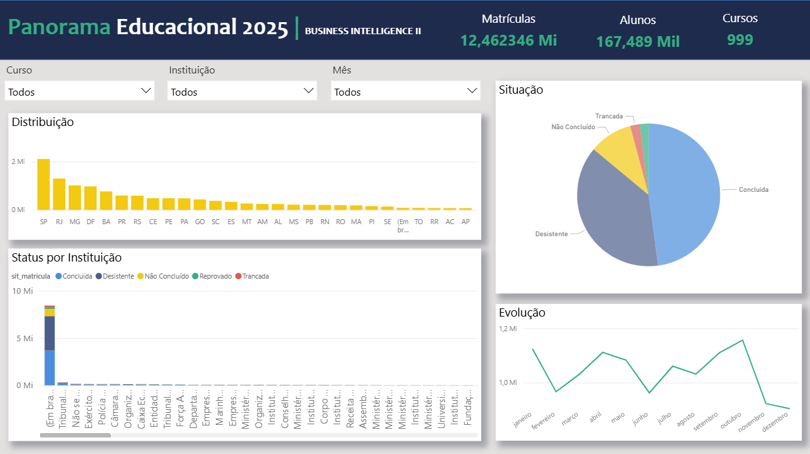
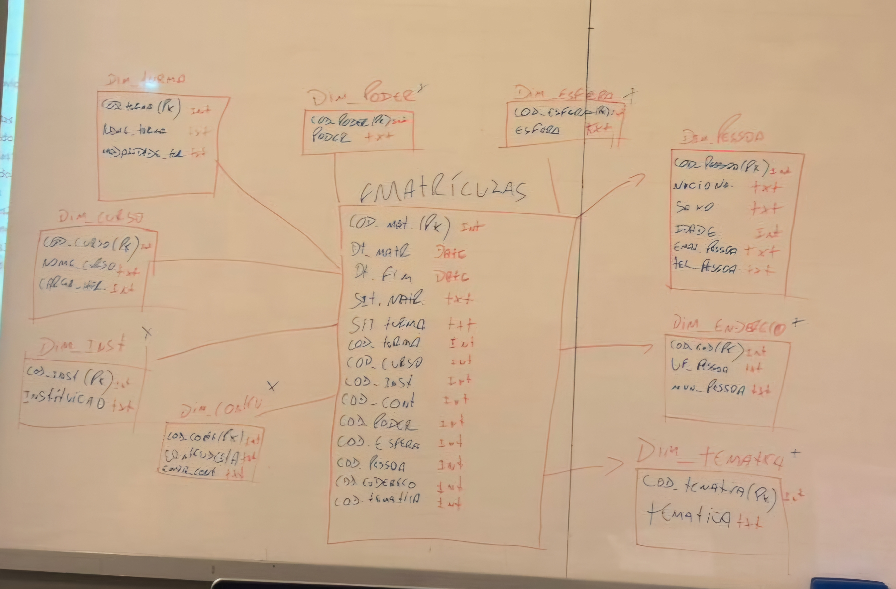

 

<h1 align="center">Panorama Educacional 2025</h1>

Projeto de Business Intelligence desenvolvido no Power BI para análise de dados educacionais.
 

---

## Visão do Dashboard

  
   
  <em>Painel principal com indicadores e visualizações do projeto</em>

---

## Sobre o Projeto

Este projeto foi desenvolvido como atividade prática da disciplina de **Business Intelligence II**, com o objetivo de aplicar conceitos de:

- ETL com Power Query  
- Modelagem de dados (Star Schema)  
- Criação de medidas com DAX  
- Desenvolvimento de dashboard interativo no Power BI  

A base de dados foi fornecida pelo professor e contém informações sobre matrículas, cursos, instituições e alunos.

---

## Perguntas de Negócio

O dashboard foi pensado para responder questões como:

- Como as matrículas estão distribuídas pelo Brasil?  
- Quais estados concentram mais alunos?  
- Qual a situação das matrículas (concluída, ativa, etc.)?  
- Como os dados evoluem ao longo do tempo?  
- Existe algum padrão ou sazonalidade nas matrículas?  

---

## Indicadores do Dashboard

- Total de Matrículas  
- Total de Alunos  
- Quantidade de Cursos  
- Taxa de Conclusão  

---

## Visualizações

O dashboard conta com:

- Distribuição de matrículas por estado  
- Evolução das matrículas ao longo do tempo  
- Situação das matrículas  
- Indicadores gerais (KPIs)  
- Filtros por curso, instituição e período  

---

## Modelagem de Dados

A modelagem foi construída em sala de aula junto com o professor, seguindo o padrão **Star Schema**.

Durante esse processo, foram definidas:

- **Tabela Fato**: matrículas  
- **Dimensões**: data, curso, instituição, entre outras  

A imagem abaixo representa o modelo desenhado no quadro durante a aula, que serviu como base para a implementação no Power BI.

  
   
  <em>Modelagem definida em aula (estrutura estrela)</em>

---

## Insights Obtidos

- Alguns estados concentram grande parte das matrículas  
- A maioria das matrículas está na situação **concluída**  
- Existe variação ao longo do tempo, indicando possível sazonalidade  
- A distribuição de cursos e alunos não é uniforme  

---

## Ferramentas Utilizadas

- Power BI  
- Power Query  
- DAX  
- GitHub  

---

<a href="#readme-top">Voltar ao topo</a>
